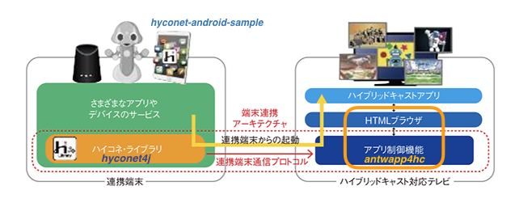
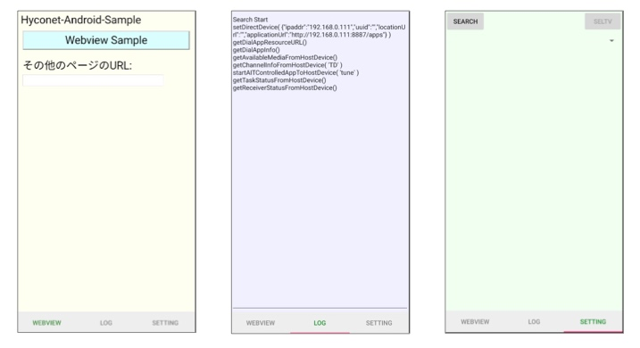

# Hyconet-android-sample

Hybridcast-Connect Client Application as Android Sample.

[English](./README.md) 

## 概要

"Hyconet-android-sample"は、IPTV Forum Japanにおいて2018年9月に標準規格化された「ハイブリッドキャストコネクト」(以後、ハイコネ)のプロトコルを使ったAndroid実装のサンプルアプリです。
ハイコネプロトコルの機能は、リファレンスSDK([hyconet4j](https://github.com/nhkrd/hyconet4j))を使うためのサンプルアプリとなっています。
ハイコネを利用すると、放送受信機能の一部の制御を受信機外のアプリケーションから実行でき、その受信機および受信機上のHybridcastサービスのブラウザアプリケーションと通信もできます。
本アプリは、ハイブリッドキャストコネクト対応の受信機を想定したAndroid実装のエミュレータである[antwapp4hc](https://github.com/nhkrd/antwapp4hc)と接続して、スマートフォン起点での端末連携拡張プロトコルAPIの疎通確認や基本機能の検証をすることができます。

詳しくは、[About "Hybridcast-Connect"](./HybridcastConnect.md)を参照ください。本ソフトウェアの利用に関しては、LICENSEおよびNOTICEファイルを参照ください。



- Reference
    - [Abount "Hybridcast-Connect"](./HybridcastConnect.md)
    - [IPTVFJ STD-0013 "ハイブリッドキャスト運用規定"](https://www.iptvforum.jp/download/input.html)
    - [W3C TPAC2018 Media&Entertainment IG "RecentAchievementOfHybridcast in TPAC2018"](https://www.w3.org/2011/webtv/wiki/images/4/45/RecentAchievementHybridcast_TPAC20181022.pdf)
    - [W3C TPAC2019 Media&Entertainment IG "RecentAchievementOfHybridcast in TPAC2019"](https://www.w3.org/2011/webtv/wiki/images/d/d1/MediaTimedEventsInHybridcast_TPAC20190916.pdf)
    - [W3C TPAC2020 Media&Entertainment IG "RecentAchievementOfHybridcast in TPAC2020"](https://www.w3.org/2011/webtv/wiki/images/2/22/RecentUpdateHybridcast_TPAC20201021_%281%29.pdf)

---

## Environment

- AndroidOS:8.0
- AndroidOS:9.0
- AndroidOS:10.0
- AndroidOS:11.0

---

## Directories

### ./app/libs

Dependent libraries that cannot be redistributed from other repositories.

- ハイコネプロトコルリファレンスSDK:[hyconet4j](https://github.com/nhkrd/hyconet4j).
    - hyconet4j-x.y.z.jar

- Other Jar Package Dependencies
    - cybergarage-upnp-core-2.1.1.jar (NOTICE: see [License](#license))
    - JSON-java-20170220.jar (NOTICE: see [License](#license))

### ./app/src/main/assets

Sample Web(HTML) Client for the webview browser on the Android Application.

For more details, see [./docs/hyconet-android-sample-web.md](./docs/hyconet-android-sample-web.md).


---

## Build

### Android Studio

Android Studio 使ってビルドを実施する.

### Docker

dockerを使ってビルドを実施する.
docker-composeを使うこともできる。

```bash
$ docker-compose build
$ docker-compose up
```

---

## Quick Install

開発目的でのインストール方法に準じます。対象のAndroid端末のOSセッティングにて、developer modeを有効にしてAndroid Studioまたはdockerでビルドしたパッケージ(apk)をAndroid Studioあるいはadbコマンド等でインストールする.


---

## Sample Android Application Overview

ここではサンプルのAndroidアプリとしての構成について説明します。

### **Structure of Android View**



- WEBVIEW Screen

    HTMLをロードして表示するためのwebbrowser(android webview)。
    初期ページであるindex.htmlではURLを入力することができるので他のHTMLをロードすることもできる。
    androidSample.htmlは、ハイコネプロトコルの機能を確認するためのhtml/javascriptのサンプルである。htmlの詳細は[./docs/hyconet-android-sample-web.md](./docs/hyconet-android-sample-web.md)を参照。


- LOG Screen

    Androidアプリの動作ログを表示するタブ画面。

- SETTING Screen

    The screen enables to call the Native APIs that have the functions to use "Hybridcast-Connect" Protocol with "[hyconet4j](https://github.com/nhkrd/hyconet4j)".

    [hyconet4j](https://github.com/nhkrd/hyconet4j)が提供する機能のAPIを直接実行することができる画面。
    

### **Additional Javascript APIs For "Hybridcast-Connect"**

Androidのサンプルアプリはandroid webviewベースのブラウザを使っています。このwebviewブラウザに"Hybridcast-Connect"で規定された拡張JavascriptAPIを実装しています。詳細は [./docs/hyconet-android-sample-web.md](./docs/hyconet-android-sample-web.md) を参照。


# License

本ソフトウェアのライセンスについては[LICENSE.txt](./LICENSE.txt)および[NOTICE.txt](./NOTICE.txt)を参照。


---

なお、本リポジトリには以下理由によりOSSパッケージを含みます。


- cybergarage-upnp-core-2.1.1.jar

    - Repository: https://github.com/cybergarage/cybergarage-upnp
    - LICENSE: https://github.com/cybergarage/cybergarage-upnp/blob/master/LICENSE.txt

    [当OSSのドキュメントに記載のMavenRepositoryのリンク](http://www.cybergarage.org:8080/maven/repo/)が不安定なため、当OSSを`maven install`して生成したjar package "cybergarage-upnp-core-2.1.1.jar"を本"hyconet4j"リポジトリは同梱しています。

- JSON-java-20170220.java

    - Repository: https://github.com/stleary/JSON-java
    - LICENSE: https://github.com/stleary/JSON-java/blob/master/LICENSE

    JSONのjava実装のスタンダートのため利用。ただし、androidで利用する場合、[当OSSのpackageName "org.json"が競合する](https://github.com/stleary/JSON-java/wiki/JSON-Java-for-Android-developers)ため、本"hyconet4j"リポジトリにおいてはandroidでの利用を想定して、packageNameを"JSON-java"へ変更し、同梱しています。
