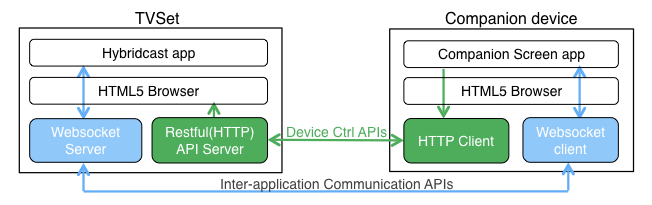
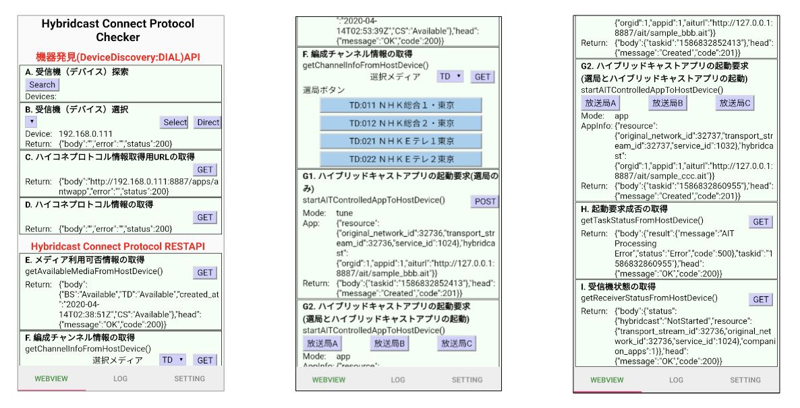

# Hyconet-android-sample-web

Sample Web Client (HTML and javascriptAPIs on webview) for Hybridcast-Connect Android Client Applicationon a Companion Device.

## Overview

The webclient of "[hyconet-android-sample](https://github.com/nhkrd/hyconet-android-sample)" is the sample application working on a android application of "the companion device" that was standardized in [IPTVFJ STD-0013](https://www.iptvforum.jp/download/input.html).
This software contains two sample applications, the sample implementation of the webview based browser(HTML5 browser) and the sample HTML as companion screen app.(see [images below](./imgs/hybridcast-connect-protocol-overview.png)) These samples are able to check the funcitons of the "Hybridcast-Connect" Protocol in [IPTVFJ STD-0013](https://www.iptvforum.jp/download/input.html). 
The webview based browser, custom HTML5 browser, provides additional javascript interfaces(APIs) for "Hybridcast-Connect" protocol that was standardized at Sep.2018 in IPTV Forum Japan. 
The HTML as companion screen app is expected to be loaded on the webview browser of the Android Application, and uses these javascript APIs to check the function of the "Hybridcast-Connect" Protocol.

For more detail, see [About "Hybridcast-Connect"](../HybridcastConnect.md). For use of "[hyconet-android-sample](https://github.com/nhkrd/hyconet-android-sample)", see [LICENSE](./LICENSE.txt) and [NOTICE](./NOTICE.txt).

--

"[hyconet-android-sample](https://github.com/nhkrd/hyconet-android-sample)"のwebクライアントは、[IPTVFJ STD-0013](https://www.iptvforum.jp/download/input.html)で規定されたコンパニオンデバイスで動作するandroidアプリ上で利用されるwebクライアントのサンプルです。このwebクライアントは、２つのサンプルで構成されています。１つは、android webview(HTML5ブラウザ）のサンプル、もう１つは、コンパニオンアプリとしてのサンプルHTMLです。（以下図を参照）
このサンプルを使ってIPTV Forum Japanにおいて2018年9月に標準規格化された「ハイブリッドキャストコネクト」(以後、ハイコネ)のプロトコルをチェックすることができます。Androidアプリ([hyconet-android-sample](https://github.com/nhkrd/hyconet-android-sample))上のHTML5ブラウザとして利用するwebviewブラウザは、ハイコネプロトコルで規定された拡張JavascriptAPIの実装サンプルとなっています。
また、HTMLは、それら拡張JavascriptAPIを使ってハイコネプロトコルの機能の動作確認ができるコンパニオンアプリの実装サンプルとなっています。

ハイコネなど、詳しくは、[About "Hybridcast-Connect"](../HybridcastConnect.md)を参照ください。本ソフトウェア"[hyconet-android-sample](https://github.com/nhkrd/hyconet-android-sample)"の利用に関しては、LICENSEおよびNOTICEファイルを参照ください。



- Reference
    - [Abount "Hybridcast-Connect"](../HybridcastConnect.md)
    - [IPTVFJ STD-0013 "ハイブリッドキャスト運用規定(Hybridcast Operational Guideline)"](https://www.iptvforum.jp/download/input.html)
    - [W3C TPAC2018 Media&Entertainment IG "RecentAchievementOfHybridcast in TPAC2018"](https://www.w3.org/2011/webtv/wiki/images/4/45/RecentAchievementHybridcast_TPAC20181022.pdf)
    - [W3C TPAC2019 Media&Entertainment IG "RecentAchievementOfHybridcast in TPAC2019"](https://www.w3.org/2011/webtv/wiki/images/d/d1/MediaTimedEventsInHybridcast_TPAC20190916.pdf)


## Environment

- Android Webview 80+ (202003 Latest)

## Directories

Here is the HTML resources in [../app/src/main/assets](../app/src/main/assets).

Sample HTMLs and others for Android App View.

```
.
|-- androidSample.css
|-- androidSample.html <-- Sample HTML Client
|-- androidSample.js   <-- JS for Sample HTML
|-- hyconet-x-polyfill.js
|-- hyconetable.js
|-- index.html         <-- Sample HTML TopPage
-- webview-js-binding
    |-- webview-hyconetable-applauncher.js       <-- JS for webview(js)-js-interface binding
    |-- webview-hyconetable-companiondevice.js   <-- JS for webview(js)-js-interface binding
    |-- webview-hyconetable-devicediscovery.js   <-- JS for webview(js)-js-interface binding
    |-- webview-hyconetable-extra.js             <-- JS for webview(js)-js-interface binding
    |-- webview-hyconetable-initialize.js        <-- JS for webview(js)-js-interface binding
    `-- webview-hyconetable.js
```


---

## Sample HTML and javascriptAPIs

### **Sample HTML**

"androidSample.html" is the sample HTML to check the functions of "Hybridcast-Connect" Protocol. The flow to check is equivalent to the part of [the typical sequence of the "Hybridcast-Connect"](../HybridcastConnect.md#hybridcast-connect-system-flow). Here is a brief instruction of the sample HTML.
Each function can be called to push button, and as a result, the message that the function returns is displayed on the window below the button. 

The list in next section shows the functions and the additional JavascriptAPIs on the webview browser respectively that are partially standardized as a recommendation on "Hybridcast-Connect" in IPTVFJ STD0013 and partially are dependent on implementation. For more detail information, see standardization, [IPTVFJ STD-0013 "Hybridcast Operational Guideline"](https://www.iptvforum.jp/download/input.html)

"androidSample.html"はハイコネプロトコルの機能を確認できるサンプルHTMLです。確認フローは、ハイコネプロトコルの典型的なシステムフローです。([the typical sequence of the "Hybridcast-Connect"](../HybridcastConnect.md#hybridcast-connect-system-flow))簡単にsample HTMLの中身を紹介します。
各機能をボタンで実行できるようにしており、実行結果はボタンの下に表示されます。
なお次のセクションではその機能およびwebviewに拡張実装されたJavascriptAPIのリストを示します。一部は、[IPTVFJ STD-0013](https://www.iptvforum.jp/download/input.html)にて推奨のJavascriptAPIとして規定されています。一部は規定されてはいないので実装依存のJavascriptAPIです。詳細は、[IPTVFJ STD-0013 "Hybridcast Operational Guideline"](https://www.iptvforum.jp/download/input.html)を参照ください。



- A: Device Discovery
    - Device discovered, the window displays the list of the devices.
    - ハイコネプロトコル（一部はDIALプロトコル）デバイスの探索。一部はDIALプロトコルをそのまま利用し、規定されていない箇所はハイコネプロトコルで規定している。
- B: Select Device
    - Tap "Select" button to select the name of the device in the list of the devices discovered.
    - デバイス選択。デバイス探索で発見したデバイスのリストからデバイス名を選択する。
- C: getDIALApplicationResourceURL
    - Get DIAL-Application-Resource-URL to get application information by DIAL protocol. Tap "GET" button to get Application-Resource-URL from the URL(Application-URL) provided by the response of the device-discovery request.
    - アプリ(サービス）情報取得のためのDIAL規定されたApplication-Resource-URLの取得（生成）。
- D: getDIALApplicationInformation
    - Get application(Hybridcast-Connect service) information, such as protocolVersion, API endpointURLs.
    - ハイコネプロトコル情報の取得を実行し、プロトコルバージョンやAPIendpointURLの情報などを取得する。
- E: getMediaAvailability
    - Tap "GET" button to request mediaAvailabilityAPI to selected device(a TV set). It is able to check availability of broadcast tuner on device.
    - 選択したデバイスに対してメディア(地上デジタル、BS、CS)利用可否情報の取得をする。放送受信機能（放送メディア）の対応可否を確認できる。
- F: getChannelsInfo
    - Tap "GET" to request channelsInfoAPI to selected device(a TV set). The information of the channels are displayed as buttons to tune the specified channel. 
    - 選択したデバイスに設定されている選局可能な編成チャンネル情報を取得し、そのチャンネルリストを選局ボタンとして表示する。
- G1: startAIT(tune)
    - Tap a button to request startAITAPI(tune) to selected device(a TV set). In this sample, 1 button to tap is prepared, but the other buttons are displayed in the window of the "F: getChannelsInfo".
    - ハイブリッドキャストアプリの起動要求(選局)を実行。サンプルでは、１パターンのチャンネル選局用ボタンを用意している。
- G2: startAIT(app)
    - Tap a button to request startAITAPI(app) to selected device(a TV set). In this sample, the channel parameters to request are specified.
    - ハイブリッドキャストアプリの起動要求(選局)を実行する。サンプルでは、３つのパターンのチャンネル選局用ボタンを用意している。 
- H: getTaskStatus
    - Tap a button to request taskStatusAPI. It is able to get status of startAIT request.
    - ハイブリッドキャストアプリ起動リクエスト(startAIT)の実行タスクのステータスを取得することができる。
- I: getReceiverStatus
    - Tap a button to request status related with receiver device. It is able to get status of HTML5 browser, the number of communicating apps on companion devices and current channel.
    - 受信機状態の取得リクエストを実行し、HTML5ブラウザエンジンの起動状態、コンパニオンアプリ接続数、現在の編成チャンネルの状態を取得する。


### **Sample implementation of hybridcast-connect javascript API on webview**


#### **Discovery**

JavascriptObject: window.hyconetjs.dd

| Label | Function<br/>Descripton | Standardization<br/>Reference | JavascriptAPI<br/>on the sample | Standard<br/>-ized as JSAPI | 
| --- | --- | --- | --- | --- |
| A | 受信機（デバイス）探索 <br/> Device Discovery/Description | IPTVFJ STD-0013<br/>7.2.1.1/7.2.1.1.1<br/>DIAL 5.1/5.2/5.3/5.4 | hyconetjs<br/>.dd.deviceSearch | - |
| B |  受信機（デバイス）選択 <br/>Device Select | - | hyconetjs<br/>.dd.setDevice | - |
| C | ハイコネプロトコル情報取得用URLの取得<br/> get DialAppResourceURL | DIAL 6.1/B.5 | hyconetjs<br/>.dd.getDialAppResourceURL | - |
| D | ハイコネプロトコル情報の取得 <br/> get DialAppInformation<br/>/AdditionalData | IPTVFJ STD-0013<br/>7.2.1.1.2<br/>DIAL 6.1/B.6/B.7 | hyconetjs<br/>.dd.getDialAppInfo | - |


#### **TVControlAPI**

JavascriptObject: window.appLauncher

| Label | Function<br/>Descripton | Standardization<br/>Reference | JavascriptAPI | Standard<br/>-ized | 
| --- | --- | --- | --- | --- |
| E | メディア利用可否情報の取得 <br/>get MediaAvailability in a TV set | IPTVFJ STD-0013<br/>7.1.7.1.1 | appLauncher<br/>.getAvailableMediaFromHostDevice | O |
| F | 編成チャンネル情報の取得 <br/> get channels information stored in a TV set | IPTVFJ STD-0013<br/>7.1.7.1.2 | appLauncher<br/>.getChannelInfoFromHostDevice | O |
| G | ハイブリッドキャストアプリの起動要求<br>(選局/ハイブリッドキャストアプリの起動) <br/>startAIT API. tune the specified channel <br/>and/or launch the specified hybridcast app <br/>on a browser in a TV set | IPTVFJ STD-0013<br/>7.1.7.2.1 | appLauncher<br/>.startAITControlledAppToHostDevice | O |
| H | 起動要求成否の取得 <br/> get status tune/hybridcast API(startAIT) request | IPTVFJ STD-0013<br/>7.1.7.3.1 | appLauncher<br/>.getTaskStatusFromHostDevice | O |
| I | 受信機状態の取得 <br/>get receiver status | IPTVFJ STD-0013<br/>7.1.7.3.2 | appLauncher<br/>.getReceiverStatusFromHostDevice | O |


#### **companionCommunicationAPI**

JavascriptObject: window.companionDevice

Javascript APIs below for companionCommunication are implemented in [webview-hyconetable-companiondevice.js](../app/src/main/assets/webview-hyconetable-companiondevice.js), but there is no sample.

websocketを使った連携端末APIについては、以下のJavascriptのInterfaceのみ実装済。[webview-hyconetable-companiondevice.js](../app/src/main/assets/webview-hyconetable-companiondevice.js)

| Label | Function<br/>Descripton | Standardization<br/>Reference | JavascriptAPI | Standard<br/>-ized | 
| --- | --- | --- | --- | --- |
| - | TV受信機側へのメッセージ送信 <br/> send message to the side of TV set  | IPTVFJ STD-0013<br/>7.1.6.1.2 | companionDevice<br/>.sendtextToHostDevice | O 
| - | TV受信機からのメッセージ受信 <br/> receive message to the side of TV set  | IPTVFJ STD-0013<br/>7.1.6.1.2 | companionDevice<br/>.addHostDeviceTextMessageListener | O |
| - | 端末連携通信の接続状況 <br/> status of companion communication   | IPTVFJ STD-0013<br/>7.1.6.1.3 | companionDevice<br/>.isConnected | O |
| - | Interfaceリストの表示 <br/> show available APIs | IPTVFJ STD-0013<br/>7.1.6.1.3 | companionDevice<br/>.showCAUserInterface | O |
| - | HTML遷移 <br/> replace another HTML on the same window in a client. | IPTVFJ STD-0013<br/>7.1.6.1.3 | companionDevice<br/>.replaceApplication | O |
| - | 別windowでのHTML提示 <br/> open another HTML on another window in a client. | IPTVFJ STD-0013<br/>7.1.6.1.2 | companionDevice<br/>.openWindow | O |

#### implementation info

Additional Javascript APIs to the android webview are implemented by the following methods.

- Add interfaces as native , by excuting "webview.addJavascriptInterface" to bind between the javascript interfaces of webview and java interface(HyconetWebViewJSBinding.java).
- Add interfaces as the functions of javascript , by excuting "webview.evaluateJavascript" to load "webview-hyconetable-XXXXXXXX.js".(It makes the javascript APIs asynchronous as "Hybridcast-Connect" standardized object and "Promise" object.)

--

ハイコネで規定された拡張javascriptAPIをwebviewへの実装は以下２つを使っています。

- "webview.addJavascriptInterface"を利用して、直接nativeのinterfaceとして追加実装(HyconetWebviewJSBinding.java)
- "webview.evaluateJavascript"を利用して、javascriptコードのロードによるinterfaceの追加実装(webview-hyconetable-XXXXXXXX.js)


### **polyfill**

TBD.
<!--
"hyconet-x-polyfill.js" is expected to call hybridcast-connect javascript APIs in a general browser that has no implementation of the hybridcast-connect javascriptAPIs. It is useful to develop apps that need to support hybridcast-connect javascriptAPIs. -->

---


# License

This is part of the "[hyconet-android-sample](https://github.com/nhkrd/hyconet-android-sample)".
See [LICENSE.txt](../LICENSE.txt) and [NOTICE.txt](../NOTICE.txt) in "[hyconet-android-sample](https://github.com/nhkrd/hyconet-android-sample)".

本ソフトウェアは、"[hyconet-android-sample](https://github.com/nhkrd/hyconet-android-sample)"の一部です。
ライセンスについては、"[hyconet-android-sample](https://github.com/nhkrd/hyconet-android-sample)"のリポジトリの[LICENSE.txt](../LICENSE.txt)および[NOTICE.txt](../NOTICE.txt)を参照。